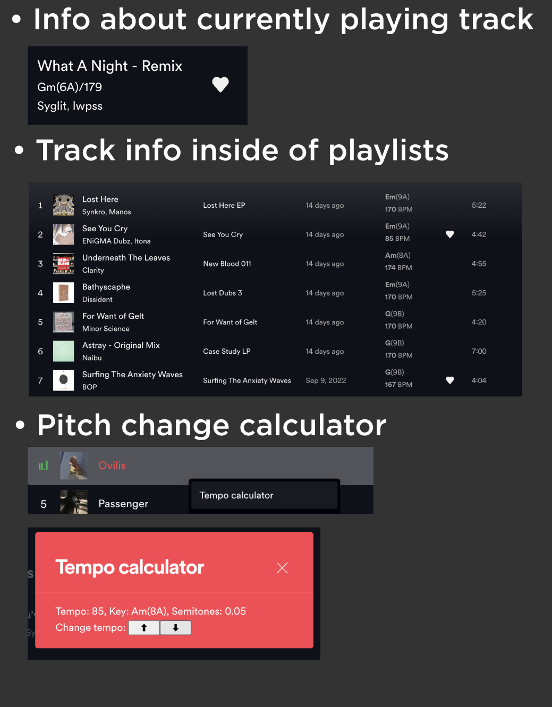

# SpotDJ

## Screenshots

## More

This extension allows you to see the BPM and Key (with Camelot style keys as well) of the currently playing track 
and tracks in the playlists/albums/etc as well as calculating pitch changes of any track.
It's an early version of the extension and might cause visual glitches.
The extension stores data about key and BPM in LocalStorage, so if you need to clear old data, you can find a 
button to do so in Settings.

## Credits
This extension uses some parts of [Spotify Star Ratings](https://github.com/duffey/spotify-star-ratings), [Spicetify Genre](https://github.com/Shinyhero36/Spicetify-Genre) and [Spicetify DJ info](https://github.com/L3-N0X/spicetify-dj-info).

**Author :** [je09](https://github.com/je09)

**License :** [MIT](https://github.com/git/git-scm.com/blob/main/MIT-LICENSE.txt)

